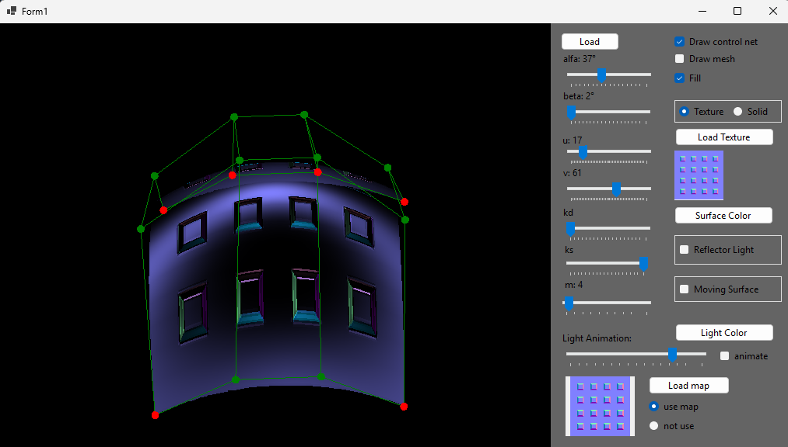

# Simple 3D Bézier Surface Engine (WinForms / C#)

This project implements an engine for generating, animating, and rendering **3D Bézier surfaces** using a set of **16 control points** arranged in a 4×4 grid.  
The engine supports loading control points from a text file, loading a PNG texture, loading a PNG normal map, and rendering the surface with **Lambert lighting**.  
It also includes animation of a moving light source and interactive controls for rotating the surface, playing with light parameters, and adjusting triangle density.

---

## Features

- **3D bicubic Bézier surface generation** (4×4 control point patch)
- **Load control points** from a `.txt` file
- **PNG texture support**
- **PNG normal map support**
- **Lambert lighting model** for simple diffuse shading
- **Animated moving light source**
- **Surface rotation**
- **Adjustable tessellation level** (increase/decrease number of triangles)
- **Interactive light manipulation** (color, intensity, position)
- **Real-time rendering**

---



---

## Control Point File Format

All example files for control points, textures, and normal maps are located in the `Files` folder of this repository.

---

## Example Control Point File

```txt
-160.0 -160.0 160.0
-55.0  -160.0  90.0
55.0   -160.0  90.0
160.0  -160.0 160.0
-170.0 -70.0 -120.0
-40.0  -70.0 -260.0
60.0   -70.0 -260.0
170.0  -70.0 -120.0
-150.0 30.0  -100.0
-45.0  30.0  -220.0
45.0   30.0  -220.0
150.0  30.0  -100.0
-140.0 170.0 160.0
-50.0  170.0  90.0
60.0   170.0  90.0
170.0  170.0 160.0


